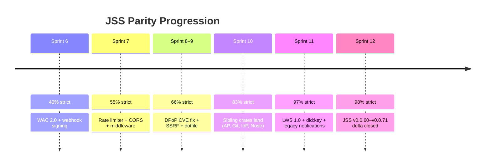
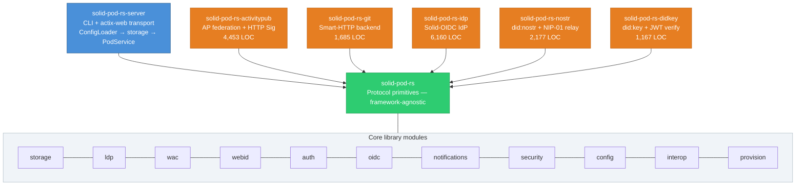
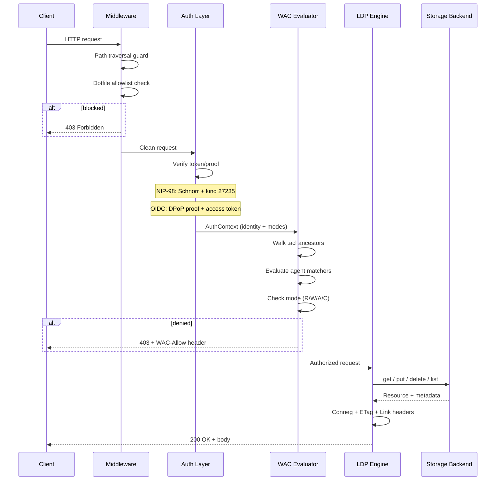

# solid-pod-rs

**A Rust-native port of
[JavaScriptSolidServer](https://github.com/JavaScriptSolidServer/JavaScriptSolidServer)
(JSS).** JSS is the reference implementation of the
[Solid Protocol](https://solidproject.org/TR/protocol) — LDP resources
and containers, Web Access Control, WebID profiles, Solid Notifications,
Solid-OIDC, ActivityPub federation, an embedded identity provider, Git
HTTP backend, NIP-98 authentication, and more. solid-pod-rs tracks the
full JSS feature surface (~98 % strict parity) and delivers it as a
framework-agnostic Rust library crate and a drop-in server binary.

[](./LICENSE)
[](https://crates.io/crates/solid-pod-rs)
[](https://docs.rs/solid-pod-rs)
[](https://github.com/dreamlab-ai/solid-pod-rs/actions/workflows/ci.yml)
[](https://releases.rs/docs/1.75.0/)

> **Upstream:** [JavaScriptSolidServer (JSS)](https://github.com/JavaScriptSolidServer/JavaScriptSolidServer) — the AGPL-3.0 reference implementation of the [Solid Protocol](https://solidproject.org/TR/protocol).
> This crate is a Rust port of JSS; see the upstream repo for the canonical feature set, issue tracker, and protocol discussion.

---

## Overview

solid-pod-rs is a Rust port of
[JavaScriptSolidServer](https://github.com/JavaScriptSolidServer/JavaScriptSolidServer)
(JSS), the AGPL-3.0 reference implementation of the
[Solid Protocol](https://solidproject.org/TR/protocol). JSS itself
implements the full Solid spec surface — LDP resources and containers,
Web Access Control (WAC), WebID profile documents, Solid Notifications
0.2, Solid-OIDC 0.1, and NIP-98 HTTP authentication — and extends it
with ActivityPub federation, an embedded OIDC identity provider, a Git
HTTP backend, Nostr relay integration, and Passkey/Schnorr SSO. This
crate tracks all of that as a framework-agnostic Rust library.
Consumers wire it into actix-web, axum, hyper, or any other HTTP
runtime; the crate has no opinions about how requests reach it.

Operators who want a turnkey deployment use the sibling binary crate
`solid-pod-rs-server`: a thin actix-web shell over the library,
wired to a JSS-compatible layered configuration loader and a CLI
that reads the same `JSS_*` environment variables as JSS. One
`cargo install` command is sufficient to run a conforming pod.

The target audience is Rust developers building sovereign-data
applications, JSS operators who want a native backend without a
Node.js runtime dependency, and teams porting Solid deployments to
compiled-language environments — edge runtimes, embedded servers,
single-binary IoT devices. Feature flags keep the dependency surface
tight: a minimal NIP-98-only build fits in under 200 KB of
transitive deps; a full OIDC + S3 + notifications build stays
under 40 MB.

---

## Quick start

### As a server binary

```bash
cargo install solid-pod-rs-server

# Minimal config — one JSON file.
cat > config.json <<'EOF'
{
  "server": { "host": "127.0.0.1", "port": 3000 },
  "storage": { "kind": "fs", "root": "./pod-root" },
  "auth":    { "nip98": { "enabled": true } }
}
EOF

solid-pod-rs-server --config config.json
```

```bash
# Round-trip a resource.
curl -i -X PUT http://127.0.0.1:3000/notes/hello.ttl \
     -H 'Content-Type: text/turtle' \
     --data-binary '<#> <http://example.org/says> "Hello, Solid".'

curl -i http://127.0.0.1:3000/notes/hello.ttl
# 200 OK
# ETag: "sha256-..."
# Link: <.acl>; rel="acl", <http://www.w3.org/ns/ldp#Resource>; rel="type"
```

All configuration keys accept either a JSON file entry or a `JSS_*`
environment variable. See
[`docs/reference/env-vars.md`](crates/solid-pod-rs/docs/reference/env-vars.md)
for the full list.

### As a library

```toml
[dependencies]
solid-pod-rs = { version = "0.4.0-alpha.1", features = ["fs-backend", "oidc"] }
```

```rust
use solid_pod_rs::{storage::FsBackend, wac::evaluate_access, ldp};
use std::path::PathBuf;

let storage = FsBackend::new(PathBuf::from("./pod-root"));
// Wire your HTTP framework of choice; see examples/embed_in_actix.rs.
```

---

## Feature matrix

| Feature                                 | Status  | Spec clause                  | Module                         | Notes |
|-----------------------------------------|---------|------------------------------|--------------------------------|-------|
| LDP Basic Containers                    | present | Solid Protocol §5.3          | `ldp`                          | `ldp:contains` direct children only. |
| LDP Resource CRUD                       | present | Solid Protocol §5.2          | `ldp`, `storage`               | Strong SHA-256 ETags. |
| Content negotiation (Turtle, JSON-LD, N-Triples) | present | §5.2.2                 | `ldp::negotiate_format`        | RDF/XML deferred. |
| Conditional requests (If-Match, If-None-Match) | present | RFC 7232              | `ldp::evaluate_preconditions`  | 304 / 412 outcomes. |
| Range requests                          | present | RFC 7233                     | `ldp::parse_range_header`      | Single-range only. |
| PATCH (N3 Patch, SPARQL-Update, JSON Patch) | present | Solid Protocol §5.2, RFC 6902 | `ldp::apply_*_patch`          | JSON Patch is a solid-pod-rs extension. |
| `Prefer` header dispatch                | present | LDP §4.2.2, RFC 7240         | `ldp::PreferHeader`            | Multi-include directives supported. |
| WAC evaluator                           | present | WAC spec §3–§4               | `wac`                          | Deny-by-default; Read / Write / Append / Control. |
| WAC inheritance via `acl:default`       | present | WAC §4.2                     | `wac::resolve_applicable_acl`  | Nearest ancestor wins. |
| WAC `acl:origin` enforcement            | present | WAC §4.3                     | `wac::origin`                  | Feature `acl-origin`. |
| Turtle ACL parsing                      | present | Solid Protocol §6            | `wac::parse_turtle_acl`        | JSON-LD fallback preserved. |
| WebID profile documents                 | present | WebID spec §2                | `webid`                        | Emits `solid:oidcIssuer`. |
| NIP-98 authentication (structural)      | present | NIP-98                       | `auth::nip98`                  | Always on. |
| NIP-98 Schnorr signature verification   | present | BIP-340                      | `auth::nip98::verify_schnorr_signature` | Feature `nip98-schnorr`. |
| Solid-OIDC 0.1                          | present | Solid-OIDC §3–§5             | `oidc`                         | Feature `oidc`. |
| DPoP                                    | present | RFC 9449                     | `oidc::dpop`                   | Proof binding + iat/htm/htu. |
| DPoP `jti` replay cache                 | present | Solid-OIDC §5.2, RFC 9449 §11.1 | `oidc::replay`              | Feature `dpop-replay-cache`. |
| WebSocketChannel2023 notifications      | present | Solid Notifications 0.2      | `notifications::websocket`     | |
| WebhookChannel2023 notifications        | present | Solid Notifications 0.2      | `notifications::webhook`       | |
| Legacy `solid-0.1` WebSocket adapter    | present | Legacy SolidOS               | `notifications::legacy`        | Feature `legacy-notifications`. |
| SSRF guard                              | present | OWASP ASVS §10.8             | `security::ssrf`               | Feature `security-primitives`. |
| Dotfile allowlist                       | present | Solid Protocol §3.5          | `security::dotfile`            | Default: `.acl`, `.meta`, `.account`. |
| Layered config loader (JSS-compatible)  | present | —                            | `config`                       | Feature `config-loader`. |
| Well-known Solid discovery document     | present | Solid Protocol §4.1.2        | `interop::well_known_solid`    | |
| WebFinger (JRD)                         | present | RFC 7033                     | `interop::webfinger_response`  | |
| FS backend                              | present | —                            | `storage::fs`                  | Default. |
| In-memory backend                       | present | —                            | `storage::memory`              | Default; used in tests. |
| S3 backend                              | present | —                            | `storage::s3`                  | Feature `s3-backend`. |
| Size-capped ACL parsing (DoS protection) | present | CWE-400                     | `wac::parse_turtle_acl_with_limit` | Sprint 12. `JSS_MAX_ACL_BYTES` (default 1 MiB). |
| Password-length validation              | present | CWE-521                      | crate `solid-pod-rs-idp`       | Sprint 12. Min 8 chars (JSS commit `1feead2`). |
| ActivityPub federation                  | functional | —                        | crate `solid-pod-rs-activitypub` | Sprint 10 + 12. Rows 102–108, 131, 169–172. |
| Git HTTP backend                        | functional | —                        | crate `solid-pod-rs-git`       | Sprint 10. Rows 69, 100. |
| Embedded Solid-OIDC IDP                 | functional | —                        | crate `solid-pod-rs-idp`       | Sprint 10–12. Rows 74–81, 130. Passkeys + Schnorr (Sprint 11); password validation (Sprint 12). |
| did:nostr resolver + embedded relay     | functional | —                        | crate `solid-pod-rs-nostr`     | Sprint 10. Rows 89, 90, 101, 132. |
| did:key (Ed25519/P-256/secp256k1) + self-signed JWT verifier | functional | W3C did:key + LWS 1.0 SSI | crate `solid-pod-rs-didkey`    | Sprint 11 (NEW). Row 153. |

Full parity tracking against the reference JavaScript implementation
lives in
[`crates/solid-pod-rs/PARITY-CHECKLIST.md`](crates/solid-pod-rs/PARITY-CHECKLIST.md)
→ **~100 % spec-normative parity / ~98 % strict on the full 132-row tracker**
(Sprint 12 close; 702 workspace tests, 0 failing, clippy `-D warnings` clean).
Prose commentary in
[`crates/solid-pod-rs/GAP-ANALYSIS.md`](crates/solid-pod-rs/GAP-ANALYSIS.md),
and an agent-oriented integration guide with per-module JSS source
breadcrumbs in
[`crates/solid-pod-rs/docs/reference/agent-integration-guide.md`](crates/solid-pod-rs/docs/reference/agent-integration-guide.md).



---

## What ships today

The `solid-pod-rs` library crate, the `solid-pod-rs-server` binary,
and five sibling crates
(`solid-pod-rs-activitypub`, `solid-pod-rs-git`, `solid-pod-rs-idp`,
`solid-pod-rs-nostr`, `solid-pod-rs-didkey`) constitute the v0.5.0-alpha.2
shipping surface. Every module listed in the feature matrix above is
live, tested, and gated behind a stable Cargo feature.
**702 tests pass across the workspace; 0 failing; clippy `-D warnings`
clean** against the full feature set
(`oidc,dpop-replay-cache,legacy-notifications,jss-v04,acl-origin,security-primitives,config-loader,nip98-schnorr,webhook-signing,did-nostr,rate-limit,quota,passkey,schnorr-sso`).

**Library surface** (crate `solid-pod-rs`):

- `storage` — `Storage` trait + FS / Memory / S3 backends.
- `ldp` — LDP Basic Containers, resource CRUD, conneg, PATCH (N3 /
  SPARQL-Update / JSON Patch), `Prefer`, conditional + range requests,
  `.meta` / `.acl` content negotiation.
- `wac` — deny-by-default evaluator with `acl:default` inheritance,
  `acl:origin` enforcement, WAC 2.0 conditions framework
  (`acl:ClientCondition`, `acl:IssuerCondition`), JSON-LD + Turtle ACL
  parsers with size + depth caps (`parse_turtle_acl_with_limit`,
  `parse_jsonld_acl_with_limits` — CWE-400 DoS hardening, Sprint 12).
- `webid` — profile documents emitting `solid:oidcIssuer` and
  CID-bound storage links.
- `auth::nip98` — NIP-98 HTTP authentication; BIP-340 Schnorr signature
  verification under `nip98-schnorr`.
- `oidc` — Solid-OIDC 0.1 with DPoP proof signature verification (RFC
  9449 §4.3 `ath` binding, algorithm allowlist, `jti` replay cache),
  SSRF-guarded JWKS fetcher with DNS-rebinding defence, RFC 7638
  canonical thumbprints.
- `notifications` — WebSocketChannel2023, WebhookChannel2023 with
  RFC 9421 Ed25519 signing + circuit breaker, legacy `solid-0.1`
  adapter with WAC read-check on subscribe.
- `security` — SSRF guard (RFC 1918 / loopback / link-local / cloud
  metadata, DNS failure blocking), dotfile allowlist (`.acl`, `.meta`,
  `.well-known`, `.quota.json`, `.account`), CORS policy, sliding-window
  LRU rate limiter.
- `quota` — per-pod `.quota.json` sidecar with atomic writes (P0
  hardening, Sprint 8).
- `multitenant` — `PodResolver` trait; path-based + subdomain modes.
- `config` — JSS-compatible layered loader (`JSS_*` env vars).
- `interop` — `/.well-known/solid`, WebFinger JRD, NodeInfo 2.1,
  did:nostr resolver (Tier 1 + Tier 3, `alsoKnownAs` cross-verified).
- `provision` — pod bootstrap: WebID + containers + type indexes +
  public-read ACL.

**Binary surface** (crate `solid-pod-rs-server`):

- Actix-web route table covering LDP verbs, `.well-known/*` and
  did:nostr; `PathTraversalGuard` + `DotfileGuard` middleware; WAC
  enforcement on writes; optional rustls TLS.

### Sibling crates (Sprint 10–12 — all functional)

All five sibling crates are functional and shipping. Integrators may
take a dependency today.

| Crate | LOC | Rows | Landed |
|-------|-----|------|--------|
| `crates/solid-pod-rs-activitypub` | 4,453 | 102–108, 131, 169–172 | Sprint 10 + 12 (outbox POST, Accept-negotiation, actor cache, `enqueue_to_inboxes`) |
| `crates/solid-pod-rs-git`         | 1,685 | 69, 100        | Sprint 10 |
| `crates/solid-pod-rs-idp`         | 6,160 | 74–81, 130     | Sprint 10–12 (Passkeys/Schnorr Sprint 11; password validation Sprint 12) |
| `crates/solid-pod-rs-nostr`       | 2,177 | 89, 90, 101, 132 | Sprint 10 |
| `crates/solid-pod-rs-didkey`      | 1,167 | 153            | Sprint 11 |

The did:nostr resolver shipped in Sprint 6 lives inside the core library
(`interop::did_nostr`) as well as the `solid-pod-rs-nostr` crate, so the
Tier 1 + Tier 3 DID flow is available either way.

---

## Architecture

solid-pod-rs is a Cargo workspace. Each crate has a single
responsibility, with a strict one-way dependency gradient.



The library crate never constructs an HTTP server. Consumers own the
transport, the routing, and the runtime. The server crate is the
canonical example of wiring the library into actix-web; the patterns
it uses are documented in
[`crates/solid-pod-rs/examples/embed_in_actix.rs`](crates/solid-pod-rs/examples/embed_in_actix.rs).

### Request lifecycle

Every inbound request follows the same three-phase pipeline regardless
of which auth mechanism the client uses:



This split — formalised in
[`crates/solid-pod-rs/docs/explanation/architecture-decisions.md`](crates/solid-pod-rs/docs/explanation/architecture-decisions.md) —
is load-bearing. It allows the library to be embedded in edge
workers and async runtimes that cannot host `actix-web::HttpServer`,
and it allows the binary to evolve independently without forcing
library revisions.

---

## Configuration

`solid-pod-rs-server` loads configuration in layers, lowest
precedence first:

1. Compiled-in defaults.
2. A JSON or TOML file passed via `--config <path>`.
3. Environment variables under the `JSS_*` namespace.

The environment variable names are deliberately identical to those
of the reference JavaScript server so that existing JSS deployment
scripts, Kubernetes manifests, and Docker Compose files continue to
work unchanged. Selected variables:

| Variable               | Type     | Purpose                                         |
|------------------------|----------|-------------------------------------------------|
| `JSS_HOST`             | string   | Bind address (default `127.0.0.1`).             |
| `JSS_PORT`             | u16      | Listen port (default `3000`).                   |
| `JSS_BASE_URL`         | URL      | Externally visible base URL.                    |
| `JSS_STORAGE_ROOT`     | path     | Filesystem root when using the FS backend.      |
| `JSS_OIDC_ISSUER`      | URL      | Identity provider discovery URL.                |
| `JSS_WORKERS`          | usize    | actix-web worker count (default: CPUs).         |
| `JSS_LOG_LEVEL`        | string   | `trace` | `debug` | `info` | `warn` | `error`. |
| `JSS_DISABLE_DOTFILES` | bool     | If set, no dotfiles are served even on allowlist. |

The full set, including S3, webhook, and notification tuning keys,
is listed in
[`crates/solid-pod-rs/docs/reference/env-vars.md`](crates/solid-pod-rs/docs/reference/env-vars.md).

---

## Authentication

solid-pod-rs ships two authentication paths, used in isolation or
side-by-side. Both funnel into the same `AuthContext`, so WAC
evaluation is transparent to the upstream mechanism.

**NIP-98 (primary).** HTTP authentication over Nostr-signed events.
Always compiled; the structural verifier runs unconditionally.
Enabling the `nip98-schnorr` feature activates BIP-340 signature
verification over the canonical NIP-01 event hash. This is the
recommended path for sovereign-identity deployments: no IDP, no
client registration, no token exchange — clients sign a
timestamp-bound event per request and the server verifies it.

**Solid-OIDC (optional).** Standards-track Solid identity, gated
behind the `oidc` feature. Discovery, dynamic client registration,
ID-token verification, and DPoP proof-of-possession per RFC 9449 are
all implemented. Operators enabling `dpop-replay-cache` also get a
per-process LRU of seen `jti` claims, closing the DPoP replay window
defined in Solid-OIDC §5.2 and RFC 9449 §11.1. The cache is bounded,
clock-aware, and safe under concurrent access; benchmarks live in
[`crates/solid-pod-rs/benches/dpop_replay_bench.rs`](crates/solid-pod-rs/benches/dpop_replay_bench.rs).

How-to guides:
- [`configure-nip98-auth.md`](crates/solid-pod-rs/docs/how-to/configure-nip98-auth.md)
- [`enable-solid-oidc.md`](crates/solid-pod-rs/docs/how-to/enable-solid-oidc.md)

---

## Access control

WAC is evaluated deny-by-default. No ACL, no access. Every resource
is paired with a sibling `.acl` document (JSON-LD or Turtle); the
evaluator walks ancestors until it finds a declared ACL, honouring
`acl:default` for inheritance.

With the `acl-origin` feature enabled, `acl:origin` authorisations
are enforced against the request `Origin` header. Clients that omit
the header, or whose origin is not listed, are denied — matching the
WAC spec §4.3 semantics. With the feature off, origin is ignored for
backward compatibility with older clients.

Supported modes: `acl:Read`, `acl:Write`, `acl:Append`,
`acl:Control`. The evaluator returns a `WacAllow` structure ready to
be serialised into the `WAC-Allow` response header per the Solid
Protocol's transparency requirement.

See [`wac-modes.md`](crates/solid-pod-rs/docs/reference/wac-modes.md)
and [`debug-acl-denials.md`](crates/solid-pod-rs/docs/how-to/debug-acl-denials.md).

---

## Notifications

Three notification surfaces are shipped:

- **WebSocketChannel2023** — the current Solid Notifications 0.2
  protocol. Subscribers `POST` a `NotificationChannel` resource and
  receive updates over a topic-bound WebSocket connection.
- **WebhookChannel2023** — identical event model, delivered as
  outbound HTTP `POST` requests with configurable retry and backoff.
- **Legacy `solid-0.1`** — a compatibility adapter for the SolidOS
  data browser's older WebSocket dialect. Gated behind
  `legacy-notifications`. Enable it when you need SolidOS UI
  compatibility; leave it off for modern clients.

Events are generated from storage-layer mutations via a
publish/subscribe bus that is backend-agnostic; custom storage
backends emit events by calling `NotificationBus::publish`.

How-to guides:
- [`enable-notifications-websocket.md`](crates/solid-pod-rs/docs/how-to/enable-notifications-websocket.md)
- [`enable-notifications-webhook.md`](crates/solid-pod-rs/docs/how-to/enable-notifications-webhook.md)

---

## Storage

The `Storage` trait abstracts the blob + metadata layer so the rest
of the crate is backend-agnostic.

- **`fs-backend`** (default) — POSIX filesystem. Stores resources
  as regular files with sidecar `.meta` documents for RDF metadata
  and `.acl` documents for access control. Supports atomic rename
  semantics for concurrent writers.
- **`memory-backend`** (default) — in-process `HashMap`. Used for
  the test corpus and for ephemeral deployments (CI, demos,
  integration harnesses).
- **`s3-backend`** (opt-in) — AWS S3 and S3-compatible object stores
  (MinIO, R2, Backblaze B2). Metadata travels in object tags; ETags
  mirror S3's strong-consistency model.

Custom backends implement four methods (`get`, `put`, `delete`,
`list`) on top of a `ResourceMeta` + `Bytes` contract. The
[`custom_storage.rs`](crates/solid-pod-rs/examples/custom_storage.rs)
example walks through a Redis-backed implementation.

---

## Relationship to JavaScriptSolidServer

solid-pod-rs is a sibling implementation, not a rewrite. It
implements the same Solid Protocol 0.11 surface as
[JavaScriptSolidServer](https://github.com/JavaScriptSolidServer/JavaScriptSolidServer)
and deliberately inherits JSS's AGPL-3.0 licence to preserve the
ecosystem's network-service copyleft. The lineage is:

```
JavaScriptSolidServer (Node.js, AGPL-3.0)
        │
        ├── reference implementation
        │
solid-pod-rs (Rust, AGPL-3.0)   ← you are here
```

JSS's ecosystem covenant is the reason we are AGPL rather than
permissive: a permissive relicence of AGPL-covered heritage would
weaken the protections the wider Solid ecosystem depends on. See
[`NOTICE`](crates/solid-pod-rs/NOTICE) for the full provenance chain
and attribution.

solid-pod-rs has reached ~98 % strict parity with JSS (0 rows
missing on the 132-row tracker; 5 explicitly deferred as legacy/P3,
4 wontfix-in-crate as consumer concerns). On top of feature parity,
the Rust port adds runtime advantages: no Node.js dependency, single
static binary, lower memory footprint, deterministic RDF
serialisation, and compile-time feature gating. See the
[parity checklist](crates/solid-pod-rs/PARITY-CHECKLIST.md) for the
full row-by-row accounting.

---

## Compatibility

Conformance targets:

- [Solid Protocol 0.11](https://solidproject.org/TR/protocol)
- [WAC spec](https://solidproject.org/TR/wac) (2022-11-08)
- [Solid Notifications 0.2](https://solidproject.org/TR/notifications-protocol)
- [Solid-OIDC 0.1](https://solidproject.org/TR/oidc)
- [NIP-98](https://github.com/nostr-protocol/nips/blob/master/98.md)
- [RFC 6902](https://www.rfc-editor.org/rfc/rfc6902) — JSON Patch
- [RFC 7232](https://www.rfc-editor.org/rfc/rfc7232) — conditional requests
- [RFC 7233](https://www.rfc-editor.org/rfc/rfc7233) — range requests
- [RFC 9449](https://www.rfc-editor.org/rfc/rfc9449) — DPoP

Explicitly deferred: RDF/XML serialisation, live-reload script
injection, LDP Direct and Indirect Containers. Rationale recorded in
[`docs/explanation/architecture-decisions.md`](crates/solid-pod-rs/docs/explanation/architecture-decisions.md).

---

## Related crates

solid-pod-rs sits within a wider sovereign-data Rust ecosystem:

- **[URN-Solid](https://github.com/dreamlab-ai/urn-solid)** — URN
  resolver for Solid resources.
- **[solid-schema](https://github.com/dreamlab-ai/solid-schema)** —
  typed schema registry over Solid pods.
- **[Solid-Apps](https://github.com/dreamlab-ai/solid-apps)** —
  reference client applications.

---

## Documentation

Full documentation lives in
[`crates/solid-pod-rs/docs/`](crates/solid-pod-rs/docs/) and follows
the [Diátaxis](https://diataxis.fr/) framework:

- **Tutorials** — learning-oriented walkthroughs for new users.
- **How-to guides** — goal-oriented recipes for specific tasks.
- **Reference** — exhaustive API and protocol documentation.
- **Explanation** — architectural background and design rationale.

The rendered documentation index is at
[`crates/solid-pod-rs/docs/README.md`](crates/solid-pod-rs/docs/README.md).

---

## Contributing

See [`CONTRIBUTING.md`](crates/solid-pod-rs/CONTRIBUTING.md). In
brief: open an issue describing the change, run `cargo test
--all-features` and `cargo clippy --all-targets --all-features
-- -D warnings` before opening a pull request, and ensure any new
public surface has a doc comment and a corresponding test.

Security issues: please follow the disclosure policy in
[`SECURITY.md`](crates/solid-pod-rs/SECURITY.md).

---

## Licence

AGPL-3.0-only. Full text in [`LICENSE`](LICENSE). If you operate
solid-pod-rs as a network-accessible service — which, by the nature
of a pod, you almost certainly will — §13 of the AGPL requires you
to provide corresponding source to your users. This matches the
reference implementation's licence and preserves the Solid
ecosystem's existing covenant.

solid-pod-rs has no Contributor Licence Agreement. Contributions are
accepted under the project's licence via the standard GitHub pull
request workflow; by opening a pull request you certify compliance
with the [Developer Certificate of Origin](https://developercertificate.org/).
