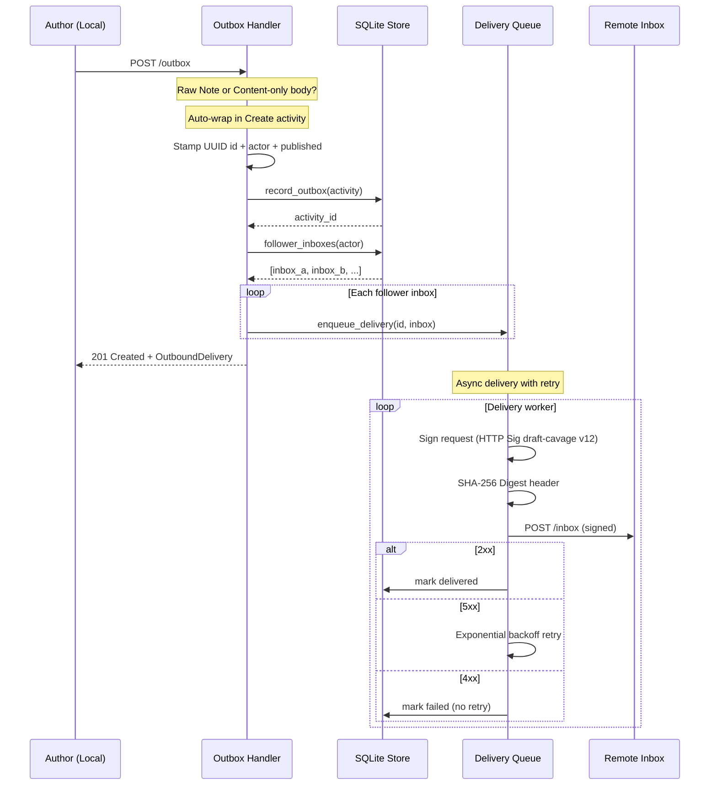
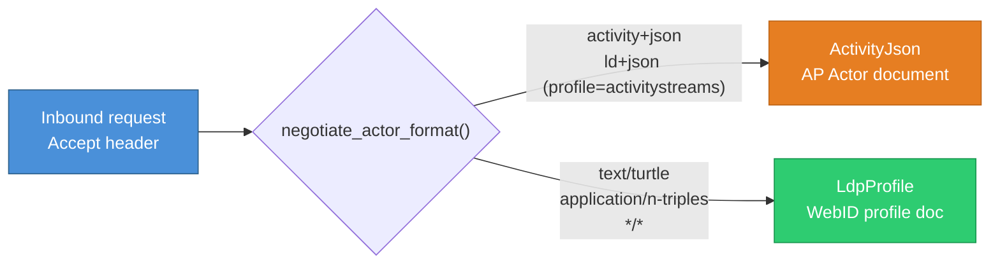

# solid-pod-rs-activitypub

**Status: 0.4.0-alpha.2 — functional ActivityPub federation crate.**

Rust port of the JSS ActivityPub surface (`JavaScriptSolidServer/src/ap/*`).
4,453 LOC across 9 modules; 53 tests. Integrators may take a dependency
today.

## What ships

| Module | Responsibility |
|--------|---------------|
| `actor` | Actor document rendering + `negotiate_actor_format()` (Accept-negotiation between `application/activity+json` and LDP profiles). |
| `inbox` | `POST /inbox` handling with HTTP Signature verification (draft-cavage-http-signatures v12). |
| `outbox` | `handle_outbox()` (pre-formed activities) + `handle_outbox_post()` (raw Notes auto-wrapped in `Create`). Follower fan-out delivery. |
| `delivery` | HTTP Signature signing, SHA-256 digest headers, exponential retry, `enqueue_to_inboxes()` batch helper. |
| `http_sig` | `HttpSignatureVerifier` + `HttpActorKeyResolver` implementing draft-cavage v12 over RSA-SHA256. |
| `store` | SQLite-backed follower/following/outbox/delivery-queue persistence. Actor cache with 24-hour freshness. |
| `error` | Typed error hierarchy (`InboxError`, `OutboxError`, `DeliveryError`, `StoreError`). |
| `webfinger` | AP-specific WebFinger JRD rendering. |
| `nodeinfo` | NodeInfo 2.1 document emission. |

## Federation flow

## Parity rows

Rows closed by this crate (see
[`../solid-pod-rs/PARITY-CHECKLIST.md`](../solid-pod-rs/PARITY-CHECKLIST.md)):

- **102** — ActivityPub Actor discovery.
- **103** — inbox with HTTP Signature verification.
- **104** — outbox emission.
- **105** — Follow / Accept / Undo handling.
- **106** — Create activity delivery.
- **107** — Follower + Following collections.
- **108** — ActivityPub conformance subset.
- **131** — NodeInfo 2.0 (AP-specific fields).

Sprint 12 additions (JSS v0.0.60–v0.0.71 delta):

- **169** — Outbox POST with Note→Create wrapping.
- **170** — Accept-negotiation for actor profiles.
- **171** — Actor cache with freshness check.
- **172** — `enqueue_to_inboxes()` batch delivery.

## Sprint 12 changes

- `handle_outbox_post()` — accepts `Note`, pre-formed Activity, or
  content-only body. Notes are auto-wrapped in `Create` with UUID IDs
  and ISO 8601 timestamps. Matches JSS v0.0.67 outbox behaviour.
- `negotiate_actor_format(accept: &str)` — returns `ActorFormat::ActivityJson`
  or `ActorFormat::LdpProfile` based on the request `Accept` header.
- `Store::cache_actor()` / `get_cached_actor()` / `is_actor_cache_fresh()`
  — 24-hour chrono-based freshness window.
- `enqueue_to_inboxes()` — batch delivery helper.
- User-Agent updated to `solid-pod-rs-activitypub/0.4.0`.

## JSS references

- `src/ap/index.js`
- `src/ap/routes/inbox.js`
- `src/ap/routes/outbox.js`
- `src/ap/store.js`
- `src/ap/keys.js`

## Licence

AGPL-3.0-only.
