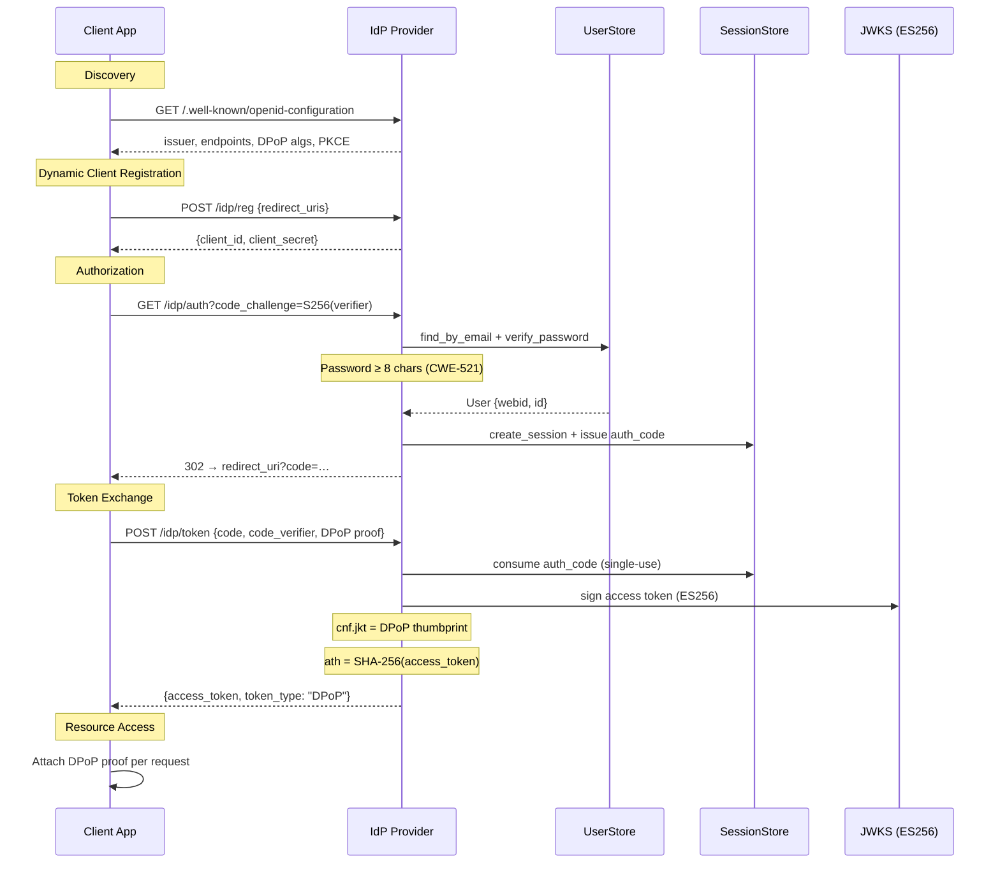
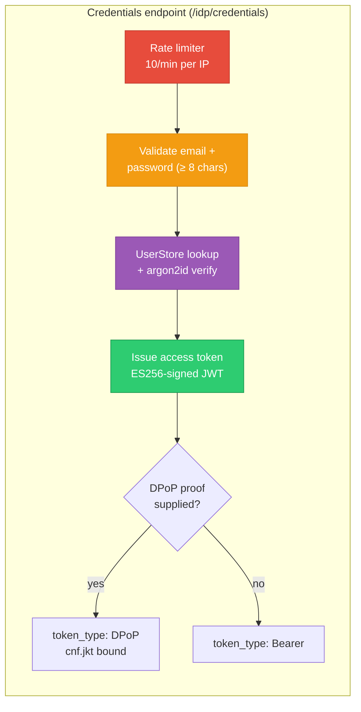

# solid-pod-rs-idp

**Status: 0.4.0-alpha.2 — Sprint 10–12 Solid-OIDC provider.**

Rust port of the JSS identity provider (`JavaScriptSolidServer/src/idp/*`).
This crate owns the **protocol** surface; transport framing is the
consumer's decision (enable `axum-binder` for a ready-made Router,
or plug `Provider` into any router you like).

## What landed in Sprint 10

Parity rows flipped from `missing` → `present` (tracked in
`../../docs/PARITY-CHECKLIST.md`):

| Row | Endpoint / feature                   | JSS ref                        |
|----:|--------------------------------------|--------------------------------|
|  74 | `/idp/auth` — authorization-code flow | `src/idp/provider.js:307-317`  |
|  75 | `/idp/reg` — Dynamic Client Registration | `src/idp/provider.js:147-156`  |
|  76 | `/.well-known/openid-configuration`  | `src/idp/index.js:203-237`     |
|  77 | `/.well-known/jwks.json`             | `src/idp/index.js:240-244`     |
|  78 | Client Identifier Documents (SSRF-guarded) | `src/idp/provider.js:22-85`    |
|  79 | `/idp/credentials` (email+password + rate-limit) | `src/idp/credentials.js`       |
| 130 | JWKS publication (IdP side)          | `src/idp/keys.js`              |

## WebAuthn + Schnorr SSO (rows 80, 81)

Sprint 11 lands real backends for both rows:

| Row | Backend | Feature flag | Notes |
|----:|---------|--------------|-------|
|  80 | [`WebauthnPasskey`] on top of `webauthn-rs` 0.5 | `passkey` | Reasonable defaults: user-verification required, `EdDSA`+`ES256`, single-step registration, in-memory challenge/credential store. Swap for a persistent store via a custom [`PasskeyBackend`] impl. |
|  81 | [`Nip07SchnorrSso`] on top of core `nip98-schnorr` | `schnorr-sso` | 32-byte CSPRNG challenges, 5-minute default TTL, one-shot consume-on-verify. Canonical digest is `SHA-256(token ‖ user_id ‖ pubkey)`. |

The trait types ([`PasskeyBackend`], [`SchnorrSso`]) stay stable so
integrators who want to bring their own backend — e.g. attestation-
pinned WebAuthn, or Redis-backed Schnorr state — can swap the default
impl without touching `Provider`.

The zero-op `PasskeyTodo` and `SchnorrTodo` types remain as
`#[doc(hidden)]` fallbacks: useful for wiring a provider up in tests
before deciding which backend to enable.

## What is `wontfix-in-crate`

| Row | Why                                  |
|----:|--------------------------------------|
|  82 | HTML interaction pages (login / consent / register). JSS bundles Handlebars templates in `src/idp/views.js`. We do not ship a view layer because the right choice depends on the consumer's existing stack (Askama, Leptos, Tera, Yew, or plain `format!`). A minimal Askama adapter on top of this crate is < 300 LOC and should live in a host-app crate where the operator controls the HTML. |

## Authorization code flow





## Minimum-viable flow

```rust,no_run
use std::sync::Arc;
use solid_pod_rs_idp::{
    Provider, ProviderConfig, Jwks, SessionStore,
    registration::ClientStore,
    user_store::{InMemoryUserStore, UserStore},
};

// 1. Seed stores.
let user_store: Arc<dyn UserStore> = Arc::new(InMemoryUserStore::new());
let client_store = ClientStore::new();
let session_store = SessionStore::new();
let jwks = Jwks::generate_es256().unwrap();

// 2. Build the provider.
let provider = Provider::new(
    ProviderConfig::new("https://pod.example/"),
    client_store,
    session_store,
    user_store,
    jwks,
);

// 3. Serve discovery + JWKS directly from the provider:
let _discovery = provider.discovery_document();
let _jwks_doc = provider.jwks().public_document();
```

## Axum binder

Enable `axum-binder` to get a Router with discovery, JWKS,
registration, and credentials pre-wired:

```toml
[dependencies]
solid-pod-rs-idp = { version = "0.4", features = ["axum-binder"] }
```

`/idp/auth` and `/idp/token` are NOT on the binder — their request
shape (session cookies, form-encoded bodies, 302 redirects) is too
app-specific for a generic binder. Wire them against your own
framework session middleware.

## Design deviations from JSS

Honest list of shape differences (not behaviour differences — those
should be zero):

1. **Signing algorithm.** JSS publishes both RS256 and ES256; we
   publish ES256 only in Sprint 10 (Solid-OIDC mandates ES256 for
   DPoP, every Solid RP we checked accepts ES256 id-tokens, and it
   skips pulling `rsa` into our dep graph). Additional algs can be
   inserted via `Jwks::insert_signing_key`.
2. **Password hash.** JSS uses `bcrypt` (`src/idp/accounts.js`);
   we use `argon2id` (stronger, OWASP-preferred). Re-hashing on
   next successful login is the consumer's migration story.
3. **Session storage.** JSS persists sessions to disk via
   `oidc-provider`'s filesystem adapter. We ship an in-memory store
   with a pluggable trait; disk persistence is the consumer's
   choice (serialise the `SigningKey::private_pem` and session
   records to their own backend).
4. **Code format.** JSS generates opaque client ids as
   `client_<base36-timestamp>_<random>`. We mirror the format.
5. **View layer.** JSS bundles Handlebars templates; we don't (see
   row 82 above).

## Sprint 12 changes

- **Password-length validation (CWE-521).** `MIN_PASSWORD_LENGTH = 8`
  constant and `validate_password_length()` helper mirror JSS commit
  `1feead2`. `LoginError::PasswordTooShort` variant returns HTTP 400
  via the Axum binder. `InMemoryUserStore::insert_user` enforces the
  same minimum at registration time.
- Re-exported: `validate_password_length`, `MIN_PASSWORD_LENGTH` from
  crate root.

## Tests

91 unit tests cover:

- Discovery document shape (`webid` in scopes, `none` auth method,
  DPoP algs, PKCE S256, issuer trailing-slash normalisation).
- JWKS publication, key rotation with retention window, prune-expired,
  round-trip through PKCS8 PEM.
- Opaque dynamic client registration + Client Identifier Documents
  (fetch, cache, id-mismatch rejection, SSRF guard trips on private
  IP, missing-redirect-uris rejection).
- Session create/lookup/revoke + authorisation-code single-use + TTL
  expiry.
- `/idp/credentials` email+password: correct password, wrong
  password, unknown user, blank input, DPoP-bound vs Bearer, rate
  limit tripping at 11th attempt.
- Authorisation-code flow end-to-end: issue code → redeem at
  `/token` → verify DPoP-bound access token. Plus negative cases
  (missing DPoP, wrong htu, PKCE mismatch, unregistered redirect,
  no PKCE attempt).
- Access-token issuance with DPoP `cnf.jkt` binding; Bearer issuance
  when no DPoP thumbprint is passed; `ath_hash` known-value check.
- Trait hook callability (passkey / schnorr null backends return
  `Unimplemented`).
- Password-length validation: too-short (7 chars), exactly 8, longer,
  empty; `MIN_PASSWORD_LENGTH` constant value.
- Registration rejects short passwords at `insert_user` time.

## Licence

AGPL-3.0-only.
