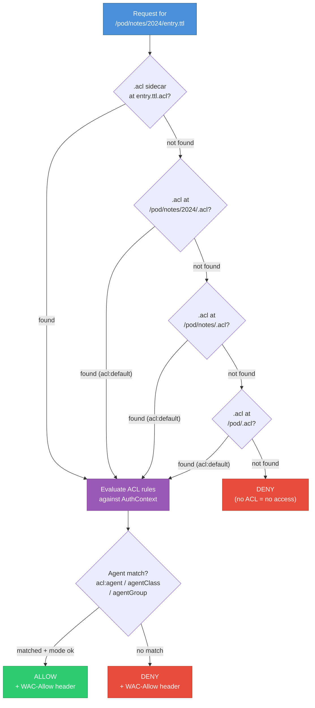

# solid-pod-rs

Framework-agnostic Rust library for serving [Solid Protocol 0.11]
pods: LDP resources and containers, Web Access Control, WebID,
Solid Notifications 0.2, Solid-OIDC 0.1, and NIP-98 HTTP auth.

**Parity vs JSS: ~100 % spec-normative** (~98 % strict on the full
132-row tracker — see [`PARITY-CHECKLIST.md`](PARITY-CHECKLIST.md)).
702 tests pass across the workspace as of Sprint 12 close (2026-05-06).

The library has no opinions about the HTTP runtime; wire it into
actix-web, axum, hyper, or any other server. For a turnkey binary
use the sibling crate [`solid-pod-rs-server`](../solid-pod-rs-server/).

```toml
[dependencies]
solid-pod-rs = "0.4.0-alpha.1"
```

```rust
use solid_pod_rs::{storage::FsStorage, wac, ldp};
use std::path::PathBuf;

let storage = FsStorage::new(PathBuf::from("./pod-root"));
// Compose with your framework; see examples/embed_in_actix.rs.
```

## Feature flags

| Flag                    | Default | Purpose                                       |
|-------------------------|:-------:|-----------------------------------------------|
| `fs-backend`            | on      | POSIX filesystem storage.                     |
| `memory-backend`        | on      | In-process `HashMap` storage (tests/demos).   |
| `s3-backend`            | off     | AWS S3 / S3-compatible object stores.         |
| `oidc`                  | off     | Solid-OIDC 0.1 + DPoP.                        |
| `dpop-replay-cache`     | off     | DPoP `jti` replay cache (pulls `oidc`).       |
| `nip98-schnorr`         | off     | BIP-340 signature verification for NIP-98.    |
| `acl-origin`            | off     | WAC `acl:origin` enforcement.                 |
| `security-primitives`   | off     | SSRF guard + dotfile allowlist.               |
| `legacy-notifications`  | off     | `solid-0.1` WebSocket adapter (SolidOS).      |
| `config-loader`         | off     | Layered config loader with `JSS_*` env vars.  |
| `webhook-signing`       | off     | RFC 9421 Ed25519 webhook signing.             |
| `did-nostr`             | off     | did:nostr resolver in `interop`.              |
| `rate-limit`            | off     | Sliding-window LRU rate limiter.              |
| `quota`                 | off     | Per-pod `.quota.json` sidecar (atomic writes).|

## Modules

| Module          | Responsibility                                               |
|-----------------|--------------------------------------------------------------|
| `storage`       | `Storage` trait + FS / Memory / S3 backends.                 |
| `ldp`           | Resources, containers, content negotiation, PATCH, `Prefer`. |
| `wac`           | Access control evaluator + WAC 2.0 conditions framework.     |
| `webid`         | WebID profile documents (emits `solid:oidcIssuer` + CID).    |
| `auth`          | NIP-98 HTTP authentication.                                  |
| `oidc`          | Solid-OIDC 0.1 + DPoP (verified) + JWKS + replay cache.      |
| `notifications` | WebSocket, Webhook (RFC 9421 signed), legacy adapter.        |
| `security`      | SSRF guard + dotfile allowlist + CORS + rate limiter.        |
| `quota`         | Per-pod `.quota.json` sidecar with atomic writes.            |
| `multitenant`   | `PodResolver` trait; path + subdomain modes.                 |
| `config`        | Layered configuration schema.                                |
| `interop`       | `.well-known/solid`, WebFinger, NodeInfo 2.1, did:nostr.     |
| `provision`     | Pod bootstrap (WebID + containers + type indexes + ACL).     |

## Sibling crate ecosystem

Five sibling crates live in the workspace — all **functional and
shipping** as of Sprint 12. Integrators may depend on them today.

| Crate                      | LOC   | Parity rows            | JSS source refs                     |
|----------------------------|-------|------------------------|-------------------------------------|
| `solid-pod-rs-activitypub` | 4,453 | 102–108, 131, 169–172  | `src/ap/{index,routes/inbox,routes/outbox,store}.js` |
| `solid-pod-rs-git`         | 1,685 | 69, 100                | `src/handlers/git.js`               |
| `solid-pod-rs-idp`         | 6,160 | 74–81, 130             | `src/idp/{index,provider,passkey,interactions,credentials}.js` |
| `solid-pod-rs-nostr`       | 2,177 | 89, 90, 101, 132       | `src/{did/resolver,nostr/relay,auth/did-nostr}.js`  |
| `solid-pod-rs-didkey`      | 1,167 | 153                    | W3C did:key spec + LWS 1.0 SSI     |

The did:nostr resolver shipped in Sprint 6 lives inside the core
library (`interop::did_nostr` under `did-nostr`) as well as the
`solid-pod-rs-nostr` crate, so the Tier 1 + Tier 3 DID flow is
available either way.

## WAC inheritance model



## Security posture

- **DPoP signature verification** against the proof's embedded JWK
  (RFC 9449 §4.3), with an algorithm allowlist (`ES256`/`ES384`,
  `RS256`/`RS384`/`RS512`, `PS256`/`PS384`/`PS512`, `EdDSA`); `alg=none`
  and HMAC hard-rejected. `ath` access-token hash binding enforced.
  `jti` replay cache under `dpop-replay-cache`.
- **SSRF guard** — RFC 1918, loopback, link-local, and cloud metadata
  endpoints are rejected on every outbound fetch (JWKS discovery,
  webhook delivery, did:nostr resolution). DNS-rebinding is closed by
  pinning the resolved IP on the per-call reqwest client.
- **Dotfile allowlist** — only `.acl`, `.meta`, `.well-known`,
  `.quota.json`, and `.account` are served. All other dotfiles return
  404 regardless of storage-layer presence.
- **RFC 7638 canonical JWK thumbprints** — replaces the previous
  hand-rolled JSON template; verified byte-for-byte against the
  spec's appendix-A vector.
- **WAC parser bounds** — 1 MiB Turtle input cap via
  `parse_turtle_acl_with_limit` (`JSS_MAX_ACL_BYTES`); 32-level
  JSON-LD depth cap via `parse_jsonld_acl_with_limits`. Returns
  `PodError::PayloadTooLarge` on oversized input (CWE-400, Sprint 12).
- **Atomic quota writes** — temp-file + rename so concurrent writers
  cannot observe a torn `.quota.json`.
- **RFC 9421 webhook signing** — Ed25519 over `@method`,
  `@target-uri`, `content-type`, `content-digest` (RFC 9530),
  `date`, `x-solid-notification-id`.

See [`SECURITY.md`](SECURITY.md) for disclosure policy and a full
cryptographic verification matrix.

## Documentation

- Workspace README: [`../../README.md`](../../README.md)
- Diátaxis docs: [`docs/`](docs/)
- Agent integration guide: [`docs/reference/agent-integration-guide.md`](docs/reference/agent-integration-guide.md)
- Parity vs JSS: [`PARITY-CHECKLIST.md`](PARITY-CHECKLIST.md)
- Gap analysis: [`GAP-ANALYSIS.md`](GAP-ANALYSIS.md)
- Changelog: [`CHANGELOG.md`](CHANGELOG.md)

## Licence

AGPL-3.0-only — see [`../../LICENSE`](../../LICENSE) and
[`NOTICE`](NOTICE).

[Solid Protocol 0.11]: https://solidproject.org/TR/protocol
